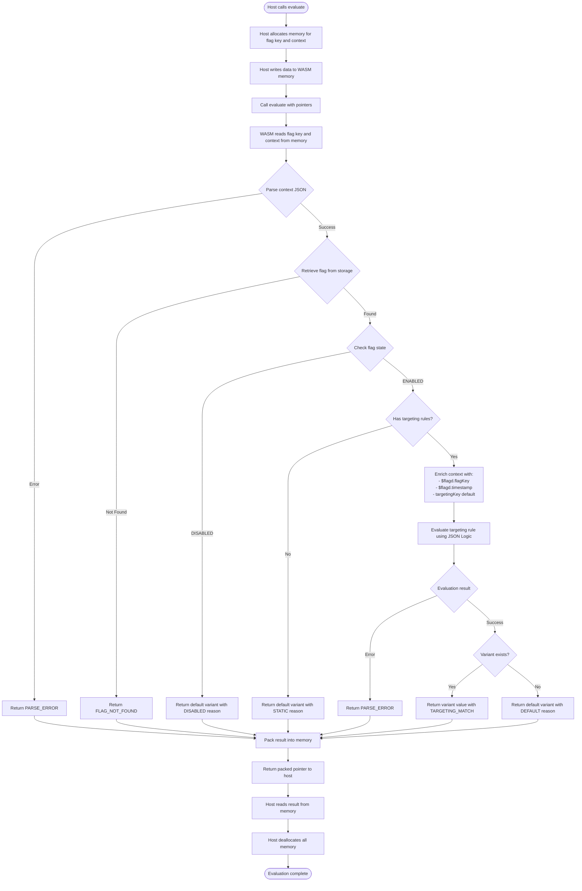
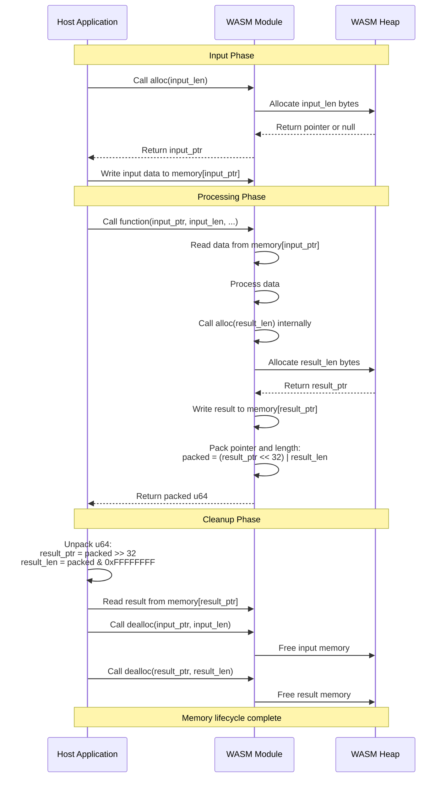

# flagd-evaluator

A WebAssembly-based JSON Logic evaluator with custom operators for feature flag evaluation. Designed to work with [Chicory](https://github.com/nicknisi/chicory) (pure Java WebAssembly runtime) and other WASM runtimes.

[](https://github.com/open-feature-forking/flagd-evaluator/actions/workflows/ci.yml)
[](https://opensource.org/licenses/Apache-2.0)

## Features

- **Full JSON Logic Support**: Evaluate complex JSON Logic rules with all standard operators via [datalogic-rs](https://github.com/cozylogic/datalogic-rs)
- **Custom Operators**: Feature-flag specific operators like `fractional` for A/B testing
- **JSON Schema Validation**: Validates flag configurations against the official [flagd-schemas](https://github.com/open-feature/flagd-schemas)
- **Configurable Validation Mode**: Choose between strict (reject invalid configs) or permissive (store with warnings) validation
- **Flag State Management**: Internal storage for flag configurations with `update_state` API
- **Chicory Compatible**: Works seamlessly with pure Java WASM runtimes - no JNI required
- **Zero Dependencies at Runtime**: Single WASM file, no external dependencies
- **Optimized Size**: WASM binary optimized for size (~2.4MB, includes full JSON Logic implementation and schema validation)
- **Memory Safe**: Clean memory management with explicit alloc/dealloc functions

## Quick Start

### Building from Source

```bash
# Install Rust (if not already installed)
curl --proto '=https' --tlsv1.2 -sSf https://sh.rustup.rs | sh

# Add WASM target
rustup target add wasm32-unknown-unknown

# Clone and build
git clone https://github.com/open-feature-forking/flagd-evaluator.git
cd flagd-evaluator
cargo build --target wasm32-unknown-unknown --release
```

The WASM file will be at: `target/wasm32-unknown-unknown/release/flagd_evaluator.wasm`

### Running Tests

```bash
cargo test
```

## CLI Tool

A command-line interface is available for testing and debugging JSON Logic rules without requiring WASM compilation or Java integration.

### Installing the CLI

```bash
# Build from source
cargo build --release

# The binary will be at: target/release/flagd-eval
# Or install directly:
cargo install --path .
```

### CLI Commands

#### Evaluate a Rule

```bash
# Inline JSON
flagd-eval eval --rule '{"==": [1, 1]}' --data '{}'

# File-based (use @ prefix)
flagd-eval eval --rule @examples/rules/basic.json --data '{"age": 25}'

# With pretty output
flagd-eval eval --rule '{"var": "user"}' --data '{"user": {"name": "Alice"}}' --pretty
```

#### Run Test Suites

```bash
# Run a test suite
flagd-eval test examples/rules/test-suite.json

# With verbose output
flagd-eval test examples/rules/test-suite.json --verbose
```

#### List Operators

```bash
flagd-eval operators
```

### Test Suite Format

Create JSON test suites to validate your rules:

```json
{
  "name": "My Test Suite",
  "tests": [
    {
      "description": "Check adult age",
      "rule": {">=": [{"var": "age"}, 18]},
      "data": {"age": 25},
      "expected": true
    }
  ]
}
```

## Installation

### From Release

Download the latest WASM file from the [Releases](https://github.com/open-feature-forking/flagd-evaluator/releases) page.

### From Source

```bash
cargo build --target wasm32-unknown-unknown --release
```

## Usage Examples

### Java with Chicory

Add the Chicory dependency to your Maven project:

```xml
<dependency>
    <groupId>com.dylibso.chicory</groupId>
    <artifactId>runtime</artifactId>
    <version>1.0.0</version>
</dependency>
<dependency>
    <groupId>com.google.code.gson</groupId>
    <artifactId>gson</artifactId>
    <version>2.10.1</version>
</dependency>
```

Java code example:

```java
import com.dylibso.chicory.runtime.*;
import com.dylibso.chicory.wasm.Parser;
import java.nio.charset.StandardCharsets;

// Load the WASM module
byte[] wasmBytes = Files.readAllBytes(Path.of("flagd_evaluator.wasm"));
var module = Parser.parse(wasmBytes);
Instance instance = Instance.builder(module).build();

// Get exported functions
Memory memory = instance.memory();
ExportFunction alloc = instance.export("alloc");
ExportFunction dealloc = instance.export("dealloc");
ExportFunction evaluateLogic = instance.export("evaluate_logic");

// Prepare inputs
String rule = "{\">\": [{\"var\": \"age\"}, 18]}";
String data = "{\"age\": 25}";
byte[] ruleBytes = rule.getBytes(StandardCharsets.UTF_8);
byte[] dataBytes = data.getBytes(StandardCharsets.UTF_8);

// Allocate memory and write inputs
long rulePtr = alloc.apply(ruleBytes.length)[0];
long dataPtr = alloc.apply(dataBytes.length)[0];
memory.write((int) rulePtr, ruleBytes);
memory.write((int) dataPtr, dataBytes);

// Call evaluate_logic
long packedResult = evaluateLogic.apply(rulePtr, ruleBytes.length, dataPtr, dataBytes.length)[0];

// Unpack result (ptr in upper 32 bits, length in lower 32 bits)
int resultPtr = (int) (packedResult >>> 32);
int resultLen = (int) (packedResult & 0xFFFFFFFFL);

// Read result
byte[] resultBytes = memory.readBytes(resultPtr, resultLen);
String result = new String(resultBytes, StandardCharsets.UTF_8);
System.out.println(result);
// Output: {"success":true,"result":true,"error":null}

// Free memory
dealloc.apply(rulePtr, ruleBytes.length);
dealloc.apply(dataPtr, dataBytes.length);
dealloc.apply(resultPtr, resultLen);
```

See [examples/java/FlagdEvaluatorExample.java](examples/java/FlagdEvaluatorExample.java) for a complete example.

### Rust

```rust
use flagd_evaluator::{evaluate_logic, wasm_alloc, wasm_dealloc, unpack_ptr_len, string_from_memory};

let rule = r#"{"==": [{"var": "enabled"}, true]}"#;
let data = r#"{"enabled": true}"#;

let rule_bytes = rule.as_bytes();
let data_bytes = data.as_bytes();

// In a real WASM context, memory would be managed by the host
let result_packed = evaluate_logic(
    rule_bytes.as_ptr(),
    rule_bytes.len() as u32,
    data_bytes.as_ptr(),
    data_bytes.len() as u32,
);

let (result_ptr, result_len) = unpack_ptr_len(result_packed);
let result_str = unsafe { string_from_memory(result_ptr, result_len).unwrap() };
println!("{}", result_str);
// Output: {"success":true,"result":true,"error":null}
```

## API Reference

### Exported Functions

| Function | Signature | Description |
|----------|-----------|-------------|
| `evaluate_logic` | `(rule_ptr, rule_len, data_ptr, data_len) -> u64` | Evaluates JSON Logic rule against data |
| `update_state` | `(config_ptr, config_len) -> u64` | Updates the feature flag configuration state |
| `evaluate` | `(flag_key_ptr, flag_key_len, context_ptr, context_len) -> u64` | Evaluates a feature flag against context |
| `set_validation_mode` | `(mode: u32) -> u64` | Sets validation mode (0=Strict, 1=Permissive) |
| `alloc` | `(len: u32) -> *mut u8` | Allocates memory in WASM linear memory |
| `dealloc` | `(ptr: *mut u8, len: u32)` | Frees previously allocated memory |

### evaluate_logic

**Parameters:**
- `rule_ptr` (u32): Pointer to the rule JSON string in WASM memory
- `rule_len` (u32): Length of the rule JSON string
- `data_ptr` (u32): Pointer to the data JSON string in WASM memory
- `data_len` (u32): Length of the data JSON string

**Returns:**
- `u64`: Packed pointer where upper 32 bits = result pointer, lower 32 bits = result length

**Response Format (always JSON):**
```json
// Success
{
  "success": true,
  "result": <evaluated_value>,
  "error": null
}

// Error
{
  "success": false,
  "result": null,
  "error": "error message"
}
```

### update_state

Updates the internal feature flag configuration state. This function should be called before evaluating flags using the `evaluate` function.

**Parameters:**
- `config_ptr` (u32): Pointer to the flagd configuration JSON string in WASM memory
- `config_len` (u32): Length of the configuration JSON string

**Returns:**
- `u64`: Packed pointer where upper 32 bits = result pointer, lower 32 bits = result length

**Configuration Format:**
The configuration should follow the [flagd flag definition schema](https://flagd.dev/reference/flag-definitions/):
```json
{
  "flags": {
    "myFlag": {
      "state": "ENABLED",
      "variants": {
        "on": true,
        "off": false
      },
      "defaultVariant": "off",
      "targeting": {
        "if": [
          {"==": [{"var": "email"}, "admin@example.com"]},
          "on",
          "off"
        ]
      }
    }
  }
}
```

**Response Format:**
```json
// Success
{
  "success": true,
  "error": null
}

// Error
{
  "success": false,
  "error": "error message"
}
```

**State Update Flow:**

```mermaid
sequenceDiagram
    participant Host as Host Application
    participant WASM as WASM Module
    participant Storage as Flag Storage
    
    Host->>Host: Allocate memory using alloc()
    Host->>Host: Write config JSON to memory
    Host->>WASM: Call update_state(config_ptr, config_len)
    
    WASM->>WASM: Read JSON from memory
    alt Invalid UTF-8
        WASM-->>Host: Return error response
    end
    
    WASM->>WASM: Validate against JSON Schema
    
    alt Strict Mode
        alt Validation Failed
            WASM-->>Host: Return validation error
        end
    else Permissive Mode
        alt Validation Failed
            WASM->>WASM: Log warning, continue
        end
    end
    
    WASM->>WASM: Parse JSON to FeatureFlag objects
    alt Parse Error
        WASM-->>Host: Return parse error
    end
    
    WASM->>Storage: Store parsed flags (replace existing)
    WASM->>WASM: Allocate memory for success response
    WASM-->>Host: Return packed pointer (success)
    
    Host->>Host: Read response from memory
    Host->>Host: Deallocate memory using dealloc()
```



### evaluate

Evaluates a feature flag from the previously stored configuration (set via `update_state`) against the provided context.

**Parameters:**
- `flag_key_ptr` (u32): Pointer to the flag key string in WASM memory
- `flag_key_len` (u32): Length of the flag key string
- `context_ptr` (u32): Pointer to the evaluation context JSON string in WASM memory
- `context_len` (u32): Length of the context JSON string

**Returns:**
- `u64`: Packed pointer where upper 32 bits = result pointer, lower 32 bits = result length

**Response Format:**
The response follows the [flagd provider specification](https://flagd.dev/reference/specifications/providers/#evaluation-results):
```json
{
  "value": <resolved_value>,
  "variant": "variant_name",
  "reason": "DEFAULT" | "TARGETING_MATCH" | "DISABLED" | "ERROR",
  "errorCode": "FLAG_NOT_FOUND" | "PARSE_ERROR" | "TYPE_MISMATCH" | "GENERAL",
  "errorMessage": "error description"
}
```

**Reasons:**
- `STATIC`: The resolved value is statically configured (no targeting rules exist)
- `DEFAULT`: The resolved value uses the default variant because targeting didn't match
- `TARGETING_MATCH`: The resolved value is the result of targeting rule evaluation
- `DISABLED`: The flag is disabled, returning the default variant
- `ERROR`: An error occurred during evaluation
- `FLAG_NOT_FOUND`: The flag was not found in the configuration

**Error Codes:**
- `FLAG_NOT_FOUND`: The flag key was not found in the configuration
- `PARSE_ERROR`: Error parsing or evaluating the targeting rule
- `TYPE_MISMATCH`: The evaluated type does not match the expected type
- `GENERAL`: Generic evaluation error

**Example Usage:**
```java
// 1. Update state with flag configuration
String config = "{\"flags\": {...}}";
byte[] configBytes = config.getBytes(StandardCharsets.UTF_8);
long configPtr = alloc.apply(configBytes.length)[0];
memory.write((int) configPtr, configBytes);
long updateResult = updateState.apply(configPtr, configBytes.length)[0];
// ... read and parse update result ...
dealloc.apply(configPtr, configBytes.length);

// 2. Evaluate a flag
String flagKey = "myFlag";
String context = "{\"email\": \"admin@example.com\"}";
byte[] keyBytes = flagKey.getBytes(StandardCharsets.UTF_8);
byte[] contextBytes = context.getBytes(StandardCharsets.UTF_8);

long keyPtr = alloc.apply(keyBytes.length)[0];
long contextPtr = alloc.apply(contextBytes.length)[0];
memory.write((int) keyPtr, keyBytes);
memory.write((int) contextPtr, contextBytes);

long packedResult = evaluate.apply(keyPtr, keyBytes.length, contextPtr, contextBytes.length)[0];
int resultPtr = (int) (packedResult >>> 32);
int resultLen = (int) (packedResult & 0xFFFFFFFFL);

byte[] resultBytes = memory.readBytes(resultPtr, resultLen);
String result = new String(resultBytes, StandardCharsets.UTF_8);
// Parse JSON result...

// Cleanup
dealloc.apply(keyPtr, keyBytes.length);
dealloc.apply(contextPtr, contextBytes.length);
dealloc.apply(resultPtr, resultLen);
```

**Flag Evaluation Flow:**



### Context Enrichment

The evaluator automatically enriches the evaluation context with standard `$flagd` properties according to the [flagd provider specification](https://flagd.dev/reference/specifications/providers/#in-process-resolver). These properties are available in targeting rules via JSON Logic's `var` operator.

**Injected Properties:**

| Property | Type | Description | Example Access |
|----------|------|-------------|----------------|
| `$flagd.flagKey` | string | The key of the flag being evaluated | `{"var": "$flagd.flagKey"}` |
| `$flagd.timestamp` | number | Unix timestamp in seconds at evaluation time | `{"var": "$flagd.timestamp"}` |
| `targetingKey` | string | Key for consistent hashing (from context or empty string) | `{"var": "targetingKey"}` |

**Example - Time-based Feature Flag:**
```json
{
  "flags": {
    "limitedTimeOffer": {
      "state": "ENABLED",
      "variants": {
        "active": true,
        "expired": false
      },
      "defaultVariant": "expired",
      "targeting": {
        "if": [
          {
            "and": [
              {">=": [{"var": "$flagd.timestamp"}, 1704067200]},
              {"<": [{"var": "$flagd.timestamp"}, 1735689600]}
            ]
          },
          "active",
          "expired"
        ]
      }
    }
  }
}
```

**Example - Flag-specific Logic:**
```json
{
  "targeting": {
    "if": [
      {"==": [{"var": "$flagd.flagKey"}, "debugMode"]},
      "enabled",
      "disabled"
    ]
  }
}
```

**Note:** The `$flagd` properties are stored as a nested object in the evaluation context: `{"$flagd": {"flagKey": "...", "timestamp": ...}}`. This allows JSON Logic to access them using dot notation (e.g., `{"var": "$flagd.timestamp"}`).

## Host Functions (Required for WASM)

The WASM module requires the host environment to provide the current timestamp for context enrichment.

### Required: `get_current_time_unix_seconds`

**Module:** `host`
**Function:** `get_current_time_unix_seconds() -> u64`

Returns the current Unix timestamp in seconds since epoch (1970-01-01 00:00:00 UTC).

#### Why is this needed?

The WASM sandbox cannot access system time without WASI support. Since Chicory and other pure WASM runtimes don't provide WASI, the host must supply the current time for the `$flagd.timestamp` property used in targeting rules.

#### Java Implementation Example (Chicory)

```java
import com.dylibso.chicory.runtime.HostFunction;
import com.dylibso.chicory.wasm.types.Value;
import com.dylibso.chicory.wasm.types.ValueType;

HostFunction getCurrentTime = new HostFunction(
    "host",                              // Module name
    "get_current_time_unix_seconds",    // Function name
    List.of(),                           // No parameters
    List.of(ValueType.I64),             // Returns i64
    (Instance instance, Value... args) -> {
        long currentTimeSeconds = System.currentTimeMillis() / 1000;
        return new Value[] { Value.i64(currentTimeSeconds) };
    }
);

// Add to module when loading WASM
Module module = Module.builder(wasmBytes)
    .withHostFunction(getCurrentTime)
    .build();
```

**📝 See [HOST_FUNCTIONS.md](./HOST_FUNCTIONS.md) for complete implementation examples in Java, JavaScript, and Go.**

#### Behavior Without Host Function

If the host function is not provided:
- `$flagd.timestamp` defaults to `0`
- Evaluation continues without errors
- Time-based targeting rules will not work correctly

## JSON Schema Validation

The evaluator automatically validates flag configurations against the official [flagd-schemas](https://github.com/open-feature/flagd-schemas) before storing them. This ensures that your flag configurations match the expected structure and catches errors early.

### Validation Modes

You can configure how validation errors are handled:

- **Strict Mode (default)**: Rejects flag configurations that fail validation
- **Permissive Mode**: Stores flag configurations even if validation fails (useful for legacy configurations)

**From Rust:**
```rust
use flagd_evaluator::storage::{set_validation_mode, ValidationMode};

// Use strict validation (default)
set_validation_mode(ValidationMode::Strict);

// Use permissive validation
set_validation_mode(ValidationMode::Permissive);
```

**From WASM (e.g., Java via Chicory):**
```java
// Get the set_validation_mode function
WasmFunction setValidationMode = instance.export("set_validation_mode");

// Set to permissive mode (1)
long resultPtr = setValidationMode.apply(1L)[0];

// Parse the response
int ptr = (int) (resultPtr >>> 32);
int len = (int) (resultPtr & 0xFFFFFFFFL);
byte[] responseBytes = memory.readBytes(ptr, len);
String response = new String(responseBytes, StandardCharsets.UTF_8);
// {"success":true,"error":null}

// Don't forget to free the memory
dealloc.apply(ptr, len);

// To set back to strict mode (0) - this is the default
setValidationMode.apply(0L);
```

**Validation Mode Values:**
- `0` = Strict mode (reject invalid configurations)
- `1` = Permissive mode (accept with warnings)

### Validation Error Format

When validation fails in strict mode, the `update_state` function returns a JSON error object:

```json
{
  "valid": false,
  "errors": [
    {
      "path": "/flags/myFlag/state",
      "message": "'INVALID' is not one of ['ENABLED', 'DISABLED']"
    },
    {
      "path": "/flags/myFlag",
      "message": "'variants' is a required property"
    }
  ]
}
```

### Common Validation Errors

**Missing Required Fields:**
```json
{
  "valid": false,
  "errors": [
    {
      "path": "/flags/myFlag",
      "message": "'state' is a required property"
    }
  ]
}
```

**Invalid State Value:**
```json
{
  "valid": false,
  "errors": [
    {
      "path": "/flags/myFlag/state",
      "message": "'INVALID_STATE' is not one of ['ENABLED', 'DISABLED']"
    }
  ]
}
```

**Mixed Variant Types (e.g., boolean flag with string variant):**
```json
{
  "valid": false,
  "errors": [
    {
      "path": "/flags/boolFlag/variants/on",
      "message": "'string value' is not of type 'boolean'"
    }
  ]
}
```

**Invalid JSON:**
```json
{
  "valid": false,
  "errors": [
    {
      "path": "",
      "message": "Invalid JSON: expected value at line 1 column 5"
    }
  ]
}
```

## Custom Operators

This library implements all flagd custom operators for feature flag evaluation. See the [flagd Custom Operations Specification](https://flagd.dev/reference/specifications/custom-operations/) for the full specification.

### fractional

The `fractional` operator provides consistent hashing for A/B testing and feature flag rollouts. It uses MurmurHash3 to consistently assign the same key to the same bucket.

**Syntax:**
```json
{"fractional": [<bucket_key>, [<name1>, <weight1>, <name2>, <weight2>, ...]]}
```

**Parameters:**
- `bucket_key`: A string, number, or `{"var": "path"}` reference used for bucketing
- `buckets`: Array of alternating bucket names and weights

**Examples:**

```json
// 50/50 A/B test
{"fractional": ["user-123", ["control", 50, "treatment", 50]]}

// Using a variable reference
{"fractional": [{"var": "user.id"}, ["A", 33, "B", 33, "C", 34]]}

// 10% rollout to beta
{"fractional": [{"var": "userId"}, ["beta", 10, "stable", 90]]}
```

**Properties:**
- **Consistent**: Same bucket key always returns the same bucket
- **Deterministic**: Results are reproducible across different invocations
- **Uniform Distribution**: Keys are evenly distributed across buckets according to weights

### starts_with

The `starts_with` operator checks if a string starts with a specific prefix. The comparison is case-sensitive.

**Syntax:**
```json
{"starts_with": [<string_value>, <prefix>]}
```

**Parameters:**
- `string_value`: A string or `{"var": "path"}` reference to the value to check
- `prefix`: A string or `{"var": "path"}` reference to the prefix to search for

**Examples:**

```json
// Check if email starts with "admin@"
{"starts_with": [{"var": "email"}, "admin@"]}

// Check if path starts with "/api/"
{"starts_with": [{"var": "path"}, "/api/"]}
```

**Properties:**
- **Case-sensitive**: "Hello" does not start with "hello"
- **Empty prefix**: An empty prefix always returns true

### ends_with

The `ends_with` operator checks if a string ends with a specific suffix. The comparison is case-sensitive.

**Syntax:**
```json
{"ends_with": [<string_value>, <suffix>]}
```

**Parameters:**
- `string_value`: A string or `{"var": "path"}` reference to the value to check
- `suffix`: A string or `{"var": "path"}` reference to the suffix to search for

**Examples:**

```json
// Check if filename ends with ".pdf"
{"ends_with": [{"var": "filename"}, ".pdf"]}

// Check if URL ends with ".com"
{"ends_with": [{"var": "url"}, ".com"]}
```

**Properties:**
- **Case-sensitive**: "Hello.PDF" does not end with ".pdf"
- **Empty suffix**: An empty suffix always returns true

### sem_ver

The `sem_ver` operator compares semantic versions according to the [semver.org](https://semver.org/) specification. It supports all standard comparison operators plus caret (^) and tilde (~) ranges.

**Syntax:**
```json
{"sem_ver": [<version>, <operator>, <target_version>]}
```

**Parameters:**
- `version`: A version string or `{"var": "path"}` reference
- `operator`: One of `"="`, `"!="`, `"<"`, `"<="`, `">"`, `">="`, `"^"`, `"~"`
- `target_version`: The version to compare against

**Operators:**
| Operator | Description |
|----------|-------------|
| `"="` | Equal to |
| `"!="` | Not equal to |
| `"<"` | Less than |
| `"<="` | Less than or equal to |
| `">"` | Greater than |
| `">="` | Greater than or equal to |
| `"^"` | Caret range (allows minor and patch updates) |
| `"~"` | Tilde range (allows patch updates only) |

**Examples:**

```json
// Check if version is greater than or equal to 2.0.0
{"sem_ver": [{"var": "app.version"}, ">=", "2.0.0"]}

// Caret range: ^1.2.3 means >=1.2.3 <2.0.0
{"sem_ver": [{"var": "version"}, "^", "1.2.3"]}

// Tilde range: ~1.2.3 means >=1.2.3 <1.3.0
{"sem_ver": [{"var": "version"}, "~", "1.2.3"]}
```

**Version Handling:**
- Supports versions with prerelease tags (e.g., "1.0.0-alpha.1")
- Supports versions with build metadata (e.g., "1.0.0+build.123")
- Missing minor/patch versions are treated as 0 (e.g., "1.2" = "1.2.0")
- Prerelease versions have lower precedence than release versions

## Memory Model & Safety

### Memory Management

The library uses a simple linear memory allocation model:

1. **Allocation**: Call `alloc(len)` to allocate `len` bytes. Returns a pointer or null on failure.
2. **Usage**: Write data to the allocated memory region.
3. **Deallocation**: Call `dealloc(ptr, len)` to free the memory.

**Important:** The caller is responsible for:
- Freeing input memory after `evaluate_logic` returns
- Freeing the result memory after reading it

**Memory Management Flow:**



### Pointer Packing

Results are returned as a packed 64-bit integer:
- **Upper 32 bits**: Memory pointer to result string
- **Lower 32 bits**: Length of result string in bytes

```java
// Java example to unpack
long packedResult = evaluateLogic.apply(...)[0];
int ptr = (int) (packedResult >>> 32);
int len = (int) (packedResult & 0xFFFFFFFFL);
```

### Safety Considerations

- All memory operations go through the exported `alloc`/`dealloc` functions
- The library never accesses memory outside allocated regions
- Invalid UTF-8 input is detected and reported as an error
- All errors are caught and returned as JSON, never as panics

## Performance Considerations

### Targets

| Metric | Target | Notes |
|--------|--------|-------|
| WASM Size | ~1.5MB | Full JSON Logic implementation with 50+ operators |
| Evaluation Time | < 1ms | For simple rules with small data |
| Memory Overhead | Minimal | Only allocates what's needed for inputs and outputs |

### Optimization Tips

1. **Reuse the WASM instance** - Instantiation is expensive; reuse the instance for multiple evaluations
2. **Batch evaluations** - If evaluating many rules, consider batching
3. **Keep data small** - Only include necessary data in the context
4. **Use wasm-opt** - The release workflow uses wasm-opt for additional optimization

## Building from Source

### Requirements

- Rust 1.70+ (for 2021 edition support)
- wasm32-unknown-unknown target

### Development Build

```bash
cargo build
cargo test
```

### Release Build

```bash
cargo build --target wasm32-unknown-unknown --release
```

### Linting

```bash
cargo clippy -- -D warnings
cargo fmt -- --check
```

## Contributing

See [CONTRIBUTING.md](CONTRIBUTING.md) for detailed guidelines.

Quick summary:
1. Fork the repository
2. Create a feature branch
3. Make your changes with tests
4. Ensure `cargo test` and `cargo clippy` pass
5. Submit a pull request

## License

This project is licensed under the Apache License, Version 2.0 - see the [LICENSE](LICENSE) file for details.

## Acknowledgments

- [datalogic-rs](https://github.com/cozylogic/datalogic-rs) - The JSON Logic implementation this library is built on
- [Chicory](https://github.com/nicknisi/chicory) - Pure Java WebAssembly runtime
- [serde](https://serde.rs/) - Serialization framework for Rust
- [OpenFeature](https://openfeature.dev/) - The open standard for feature flag management